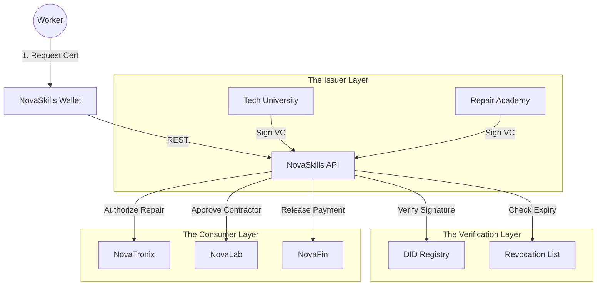

# 🎓 NovaSkills

> **The Operating System for Human Capital.**
> Verification of green skills, management of digital credentials, and coordination of the circular workforce.

[](https://www.google.com/search?q=https://github.com/novaeco-tech/novaskills/actions)
[](https://opensource.org/licenses/MIT)
[](https://www.google.com/search?q=https://skills.novaeco.tech)

**NovaSkills** is the Horizontal Enabler responsible for the **People** in the ecosystem. While `NovaMaterial` tracks the provenance of objects, **NovaSkills** tracks the competence of humans.

The circular economy creates millions of new, specialized jobs (e.g., Urban Miner, Solar Installer, Precision Agronomist). NovaSkills connects Education Providers (Issuers) with Workers (Holders) and Employers (Verifiers) to ensure that the person fixing a wind turbine or recycling hazardous waste is certified to do so.

-----

## 🎯 Value Proposition

The transition to a circular economy is stalled by a "Skills Gap." **NovaSkills** bridges this gap:

1.  **Trust & Safety:** Ensuring that a repair technician in `NovaTronix` actually has the specific certification to handle high-voltage batteries, preventing accidents.
2.  **Frictionless Hiring:** Allowing `NovaLab` projects to instantly book experts ("I need a Water Engineer") without manual background checks, using Verified Credentials.
3.  **Just Transition:** Helping workers from sunset industries (e.g., Coal mining) map their existing skills to new roles (e.g., Geothermal drilling) via "Skill Gap Analysis."

-----

## 🏗️ Architecture (The Trust Triangle)

NovaSkills implements the **W3C Verifiable Credentials (VC)** standard. It acts as a registry and exchange for digital proofs.



### Integrated Services

  * **[NovaTronix](https://www.google.com/search?q=https://electronics.novaeco.tech):** The enforcer. A technician cannot open a "Repair Ticket" for a medical device unless `NovaSkills` confirms they hold the "ISO-13485 MedTech Repair" credential.
  * **[NovaLab](https://www.google.com/search?q=https://lab.novaeco.tech):** The marketplace. When a user creates a project ("Install Solar Panel"), NovaSkills matches them with local, certified installers.
  * **[NovaFin](https://www.google.com/search?q=https://finance.novaeco.tech):** The payroll. Enables "Skill-Based Pay"—automatically releasing higher rates for workers with advanced certifications.
  * **[NovaPolicy](https://www.google.com/search?q=https://compliance.novaeco.tech):** The regulator. Checks that a company has the required ratio of certified staff to operate a hazardous waste facility.

-----

## ✨ Key Features

### 1\. Verifiable Credentials (VC) Engine

Replaces PDF certificates with cryptographic tokens.

  * **Portable:** The worker owns their data. They can take their "Reputation" from one platform to another.
  * **Tamper-Proof:** Signed by the issuer's private key. Impossible to fake a degree.

### 2\. The "Circular Gig" Dispatcher

Integration with `NovaLogistics` and `NovaLab`.

  * **Scenario:** A wind turbine sensor (`NovaInfra`) reports a fault.
  * **Action:** NovaSkills identifies the nearest technician with the "Wind Turbine L3" cert and dispatches them via the App.

### 3\. Skill Gap Heatmaps

For City Planners (using `UrbanMiner`).

  * **Insight:** "Your city produces 500 tons of e-waste but only has 10 certified repair technicians."
  * **Action:** Triggers funding for a local trade school to launch a repair course.

### 4\. Corporate Compliance Dashboard

Automated HR auditing.

  * Tracks expiration dates of safety licenses for entire teams.
  * **Alert:** "Warning: 5 forklift drivers in Warehouse B have licenses expiring in 30 days."

-----

## 🚀 Getting Started

We use **DevContainers** to provide a consistent development environment.

### Prerequisites

  * Docker Desktop
  * VS Code (with Remote Containers extension)

### Installation

1.  **Clone the repo:**
    ```bash
    git clone https://github.com/novaeco-tech/novaskills.git
    cd novaskills
    ```
2.  **Open in VS Code:**
      * Run `code .`
      * Click **"Reopen in Container"** when prompted.
3.  **Start the Enabler:**
    ```bash
    make dev
    ```
      * **Wallet Dashboard:** http://localhost:3000 (For Workers/Students)
      * **API:** http://localhost:8000/docs

### Configuration (`.env`)

```ini
# Identity Standards
DID_METHOD=did:web
ISSUER_DOMAIN=academy.novaeco.tech

# Integrations
NOVATRONIX_URL=http://novatronix-api:8000
NOVALAB_URL=http://product-nova-lab-api:8000
```

-----

## 📂 Repository Structure

This is a Monorepo containing the enabler's specific logic.

```text
novaskills/
├── api/                # Python/FastAPI (Domain Logic)
│   ├── src/
│   │   ├── credentials/ # VC signing and verification logic
│   │   ├── taxonomy/    # ESCO (European Skills/Competences) database
│   │   └── matching/    # Algorithms to match jobs to people
├── app/                # React/Next.js Frontend (The Wallet)
│   ├── src/
│   │   ├── profile/     # Display of badges and certs
│   │   └── jobs/        # Incoming gig offers
├── website/            # Documentation (Docusaurus)
└── tests/              # Integration tests
```

-----

## 🧪 Testing

We use **Cryptographic Verification** for testing.

  * **Credential Test:** `make test-vc`
      * Issues a mock certificate signed by "Test University." Verifies that the API accepts it as valid and rejects one with a tampered payload.
  * **Matchmaking Test:** `make test-match`
      * Posts a job requiring "Solar Install." Verifies that User A (Certified) appears in results, but User B (Uncertified) is filtered out.

-----

## 🤝 Contributing

We need contributors with backgrounds in **EdTech**, **Decentralized Identity (SSI)**, and **HR Tech**.
See [CONTRIBUTING.md](https://www.google.com/search?q=../.github/CONTRIBUTING.md) for details.

**Maintainers:** `@novaeco-tech/maintainers-enabler-novaskills`